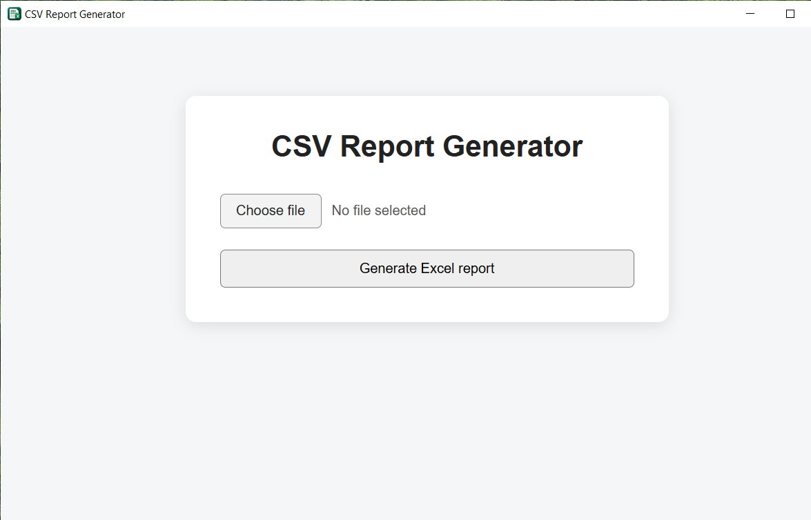

# CSV Report Generator

[](https://github.com/adambialecki008-maker/CsvReportAPI/actions/workflows/tests.yml)
[](https://www.python.org/)
[](https://fastapi.tiangolo.com/)
[](https://www.microsoft.com/windows)

A small Windows desktop application that validates customer sales CSV files and converts them into structured Excel reports.

The project combines a FastAPI backend with a lightweight local desktop UI built with pywebview. Data is processed locally on the user's machine.



## Features

- CSV file import
- business-rule validation with row-level error messages
- Excel report generation
- `Sales` worksheet with calculated revenue
- `Summary` worksheet with:
  - total revenue
  - order count
  - units sold
  - revenue per customer
  - revenue per product
- local FastAPI backend
- desktop shell based on pywebview
- automated tests with pytest
- Windows executable built with PyInstaller
- Windows installer built with Inno Setup

## Input format

Required columns:

| Column | Rule |
| --- | --- |
| `date` | `YYYY-MM-DD` |
| `customer` | non-empty text |
| `product` | non-empty text |
| `quantity` | integer greater than `0` |
| `unit_price` | number greater than or equal to `0` |

Example:

```csv
date,customer,product,quantity,unit_price
2026-09-01,ACME,Filter A,3,120.00
2026-09-01,TechPol,Filter B,2,180.00
2026-09-02,ACME,Filter B,1,180.00
```

A ready-to-use example is available in [`examples/sample_sales.csv`](examples/sample_sales.csv).

## Output

The generated workbook contains two worksheets.

### Sales

Original sales data plus calculated `revenue`.

```text
date | customer | product | quantity | unit_price | revenue
```

### Summary

Aggregated report metrics:

```text
Total revenue
Orders count
Units sold

Revenue per customer
Revenue per product
```

For the included sample data:

| Metric | Value |
| --- | ---: |
| Total revenue | 4648.00 |
| Orders | 12 |
| Units sold | 38 |

## Desktop architecture


The desktop launcher starts Uvicorn on the loopback interface only:

```text
127.0.0.1:8765
```

The UI communicates with the local FastAPI service. No external server is required for normal desktop operation.

More detail: [`docs/architecture.md`](docs/architecture.md).

## Project structure

```text
CsvReportAPI/
├── main.py
├── launcher.py
├── csv_file_repository.py
├── validation.py
├── summary.py
├── excel_report_repository.py
├── templates/
│   └── index.html
├── assets/
│   └── csv_report.ico
├── examples/
│   └── sample_sales.csv
├── tests/
│   ├── fixtures/
│   ├── test_api.py
│   ├── test_csv_file_repository.py
│   ├── test_excel_report_repository.py
│   ├── test_summary.py
│   └── test_validation.py
├── docs/
│   ├── architecture.md
│   └── screenshots/
│       └── main-window.png
├── installer.iss
├── build.ps1
├── requirements.txt
├── requirements-dev.txt
└── README.md
```

## Run from source

Create and activate a virtual environment:

```powershell
python -m venv .venv
.venv\Scripts\Activate.ps1
```

Install dependencies:

```powershell
python -m pip install -r requirements.txt
```

Run the desktop application:

```powershell
python launcher.py
```

## Run the API during development

```powershell
python -m uvicorn main:app --reload
```

Then open:

```text
http://127.0.0.1:8000/
```

Health endpoint:

```text
GET /health
```

Report endpoint:

```text
POST /reports
```

## Tests

Install development dependencies:

```powershell
python -m pip install -r requirements-dev.txt
```

Run:

```powershell
python -m pytest
```

## Build Windows executable

The included PowerShell script runs tests and builds the PyInstaller `onedir` package:

```powershell
.\build.ps1
```

The result is created in:

```text
dist\CSVReportGenerator\
```

## Build Windows installer

Open `installer.iss` in Inno Setup and compile it.

Expected output:

```text
release\CSVReportGenerator-v0.1.0-Setup.exe
```

Binary builds should be published through GitHub Releases rather than committed to the repository.

## Download

Windows builds can be published under:

[GitHub Releases](https://github.com/adambialecki008-maker/CsvReportAPI/releases/latest)

## Design decisions

- **FastAPI** separates the HTTP/API layer from reporting logic.
- **pandas** handles tabular CSV processing.
- **openpyxl** creates the final Excel workbook.
- **pywebview** provides a lightweight Windows desktop shell without requiring a separate frontend framework.
- **PyInstaller `onedir`** keeps packaging predictable for pandas/openpyxl/pywebview dependencies.
- **Inno Setup** produces a conventional Windows installer and uninstaller.
- **pytest** covers validation, aggregation, Excel generation and API behavior.

## Status

`v0.1.0` — functional desktop MVP.

Current scope is intentionally small: CSV validation and Excel reporting are complete; additional analytics and file formats are outside the v0.1 scope.
