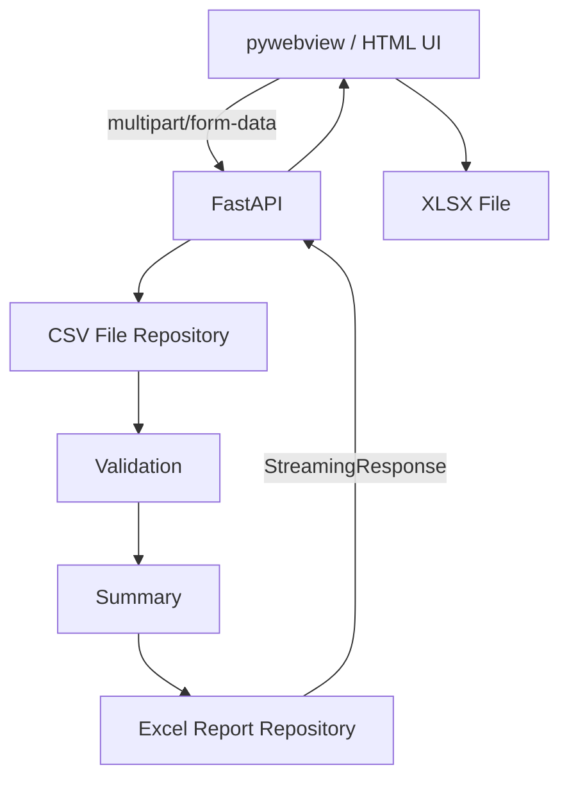

# Architecture

## Overview

CSV Report Generator is a local Windows desktop application with a FastAPI backend.



## Components

### `launcher.py`

Desktop entry point.

Responsibilities:

- start the Uvicorn/FastAPI server on `127.0.0.1`
- wait for the health endpoint
- create the pywebview window
- stop the server when the window closes

### `main.py`

HTTP boundary.

Routes:

- `GET /` — desktop/web UI
- `GET /health` — health check
- `POST /reports` — CSV upload, validation and XLSX response

### `csv_file_repository.py`

Reads uploaded CSV content into a pandas DataFrame.

### `validation.py`

Applies business validation rules and returns user-facing row-level errors.

### `summary.py`

Contains report calculations and aggregation logic.

### `excel_report_repository.py`

Builds the XLSX workbook in memory with openpyxl.

## Data flow

```text
CSV
→ pandas DataFrame
→ validation
→ aggregation
→ openpyxl workbook
→ BytesIO
→ StreamingResponse
→ XLSX
```

## Deployment model

The desktop build does not require an external web server.

```text
CSVReportGenerator.exe
  ├─ local Uvicorn server: 127.0.0.1:8765
  └─ pywebview window
```

This keeps normal report processing local to the workstation.

## Packaging

```text
Python source
→ PyInstaller --onedir
→ dist\CSVReportGenerator\
→ Inno Setup
→ CSVReportGenerator-v0.1.0-Setup.exe
```
